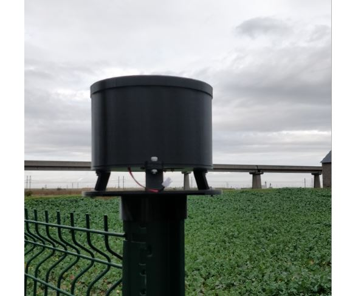

# Solar powered, waterproof, LoRa enabled raingauge

## Foreword

Designed with `Fusion 360`, let me introduce you this raingauge mark III.

You can find the mark II 3D model here : <https://www.thingiverse.com/thing:2853428>

This one is:

* waterproof
* LoRa enabled
* Totally 3D printed with `CR10s Creality`

Below funnel while being printed

## How it works

The bucket assembly tips and activates a magnetic reed switch. The sample is discharged through the base of the gauge. A momentary electrical contact is provided for each increment of rainfall. The contact closure is used to trigger an event counter or data acquisition system.

## Specifications

This raingauge is equiped with a 15 cm diameter funnel collector.

Each bucket contains about 1.6 ml of water (ie 1.6cm3).

Let's compute how much water has fallen when the bucket tips:

H = V / A

H : heigth of water in millimeter
V : volume of water per bucket in cm3
A : funnel collecting area in cm2

H = 1.6 / (pi * 7.5^2)
H = 0,00905 cm = 0,0905 mm / tip

About 0.1 mm / tip, so it quiet accurate...

Power consumption according to my Current ranger : 1542uA when sleeping (with power led on), 4,8mA when sending LoRa message

## Bill of materials (BOM)

To make this project, you'll need:

* 3D printer
* PLA
* [Reed switch](https://www.aliexpress.com/item/4000773848015.html?spm=a2g0o.productlist.0.0.6f027b5fBwPqxL&algo_pvid=b5b1a177-ee7e-49fa-8f22-be5060c7e28b&algo_expid=b5b1a177-ee7e-49fa-8f22-be5060c7e28b-0&btsid=0b0a0ae216042361074937033ebc77&ws_ab_test=searchweb0_0,searchweb201602_,searchweb201603_)
* [Arduino Pro Mini 3.3v](https://www.aliexpress.com/item/32672852945.html?spm=a2g0s.9042311.0.0.27424c4dh7WlyZ)
* [LoRa RFM95 868Mhz module](https://www.aliexpress.com/item/32817685871.html?spm=a2g0o.productlist.0.0.554d3685gCSILO&algo_pvid=76c14e05-7b66-4f08-b3e8-dec80086132e&algo_expid=76c14e05-7b66-4f08-b3e8-dec80086132e-0&btsid=2100bb4916042366878406560e9db8&ws_ab_test=searchweb0_0,searchweb201602_,searchweb201603_)
* Wire antenna of 8.2cm (See <https://learn.adafruit.com/adafruit-feather-m0-radio-with-lora-radio-module/antenna-options>)
* [TP4056 (Lithium Battery Charger Module)](https://www.aliexpress.com/item/32797834680.html?spm=a2g0o.productlist.0.0.29ee75096TX773&algo_pvid=e6187ecb-803c-435b-9056-2e0f760d53b8&algo_expid=e6187ecb-803c-435b-9056-2e0f760d53b8-0&btsid=2100bdde16042369809963715e7931&ws_ab_test=searchweb0_0,searchweb201602_,searchweb201603_)
* [Solar panel (11cm x 6cm)](https://www.aliexpress.com/item/4001226159917.html?spm=a2g0o.productlist.0.0.79c12cd9WfbBvi&algo_pvid=3dd3dc3c-4313-4cef-8e06-cd81e0430700&algo_expid=3dd3dc3c-4313-4cef-8e06-cd81e0430700-5&btsid=2100bdf016042369306381454e450d&ws_ab_test=searchweb0_0,searchweb201602_,searchweb201603_)
* One neodynium magnet (8mm diameter)
* Some resistors (see datashet)
* Some nuts and bolts
* 2 bearings

## Datasheet

Available here : <https://easyeda.com/fguiet/raingauge_lorawan>

## 3D model

You can download the 3D model for free here : <https://www.thingiverse.com/thing:4632846>

I included a mount system that fits on H pole like this one : 

If needed, I can provide the 3d model solar panel holder

## In real life

* In my garden ready for some rain pouring

* Spare parts

* Inside the beast

* Rain per hour chart

* Rain per day chart

* Battery voltage monitoring chart

