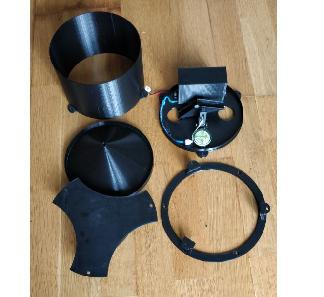

# Solar powered, waterproof, LoRaWAN enabled raingauge

## Foreword

Designed with `Fusion 360`, let me introduce you this raingauge mark III.

You can find the mark II 3D model here : <https://www.thingiverse.com/thing:2853428>

This one is:

* waterproof
* LoRaWAN enabled 
* Solar powered
* Totally 3D printed with `CR10s Creality`

Below funnel while being printed


## How it works

The bucket assembly tips and activates a magnetic reed switch. The sample is discharged through the base of the gauge. A momentary electrical contact is provided for each increment of rainfall. The contact closure is used to trigger an event counter or data acquisition system.

In my case, data are sent using LoraWAN network protocol and received on my own LoraWAN gateway. 

As soon as a message is received on my [RAK7244 LoraWAN gateway](https://docs.rakwireless.com/Product-Categories/WisGate/RAK7244/Datasheet/), it is transmitted to the [Things Network](https://console.thethingsnetwork.org/) (a global community building an open-source and decentralized LoRaWAN network) and to my MQTT server. If interested, on that part of my infrastructure, see my Github on the subject [Rak2245-LoRa-Gateway](https://github.com/fguiet/rak2245-lora-gateway)

## The Thing Network

To received the message sent by the raingauge on [Things Network](https://console.thethingsnetwork.org/), it is quite easy. You just have to register your LoraWAN Gateway and add an application on the Thinks Network website (refers to the Thinks Network website for more information).

Once your application has been set up on the Things Network, the payload can be decoded using the custom decoder function below :

```javascript
function Decoder(bytes, port) {
  // Decode plain text; for testing only 
  return {
      myTestValue: String.fromCharCode.apply(null, bytes)
  };
}
```

## Specifications

This raingauge is equiped with a 15 cm diameter funnel collector.

Each bucket contains about 2 ml of water (ie 2cm3).

Let's compute how much water has fallen when the bucket tips:

H = V / A

H : heigth of water in millimeter
V : volume of water per bucket in cm3
A : funnel collecting area in cm2

H = 2 / (pi * 7.5^2)

H = 0,011317 cm = 0,11317 mm / tip

H = 0,01075 cm = 0.1075 mm / tip (for a 1.9 ml bucket instead of 2 ml)

About 0.1 mm / tip, so it quiet accurate...

Power consumption according to my Current ranger : 1542uA when sleeping (with power led on), 4,8mA when sending LoRa message

**Power consumption :**
  *  according to my Current ranger : 1542uA when sleeping (with power led on), 4,8mA when sending LoRa message

## Bill of materials (BOM)

To make this project, you'll need:

* 3D printer
* PLA
* [Reed switch](https://www.aliexpress.com/item/4000773848015.html?spm=a2g0o.productlist.0.0.6f027b5fBwPqxL&algo_pvid=b5b1a177-ee7e-49fa-8f22-be5060c7e28b&algo_expid=b5b1a177-ee7e-49fa-8f22-be5060c7e28b-0&btsid=0b0a0ae216042361074937033ebc77&ws_ab_test=searchweb0_0,searchweb201602_,searchweb201603_)
* [Arduino Pro Mini 3.3v](https://www.aliexpress.com/item/32672852945.html?spm=a2g0s.9042311.0.0.27424c4dh7WlyZ)
* [LoRa RFM95 868Mhz module](https://www.aliexpress.com/item/32817685871.html?spm=a2g0o.productlist.0.0.554d3685gCSILO&algo_pvid=76c14e05-7b66-4f08-b3e8-dec80086132e&algo_expid=76c14e05-7b66-4f08-b3e8-dec80086132e-0&btsid=2100bb4916042366878406560e9db8&ws_ab_test=searchweb0_0,searchweb201602_,searchweb201603_)
* Wire antenna of 8.2cm (See <https://learn.adafruit.com/adafruit-feather-m0-radio-with-lora-radio-module/antenna-options>)
* Update 2020/12/11 : Change TP4056 model from [this one](https://fr.aliexpress.com/item/32705078422.html) to [this one](https://components101.com/tp4056a-li-ion-battery-chargingdischarging-module). This new model includes a over-discharge protection.
* [Solar panel (11cm x 6cm)](https://www.aliexpress.com/item/4001226159917.html?spm=a2g0o.productlist.0.0.79c12cd9WfbBvi&algo_pvid=3dd3dc3c-4313-4cef-8e06-cd81e0430700&algo_expid=3dd3dc3c-4313-4cef-8e06-cd81e0430700-5&btsid=2100bdf016042369306381454e450d&ws_ab_test=searchweb0_0,searchweb201602_,searchweb201603_)
* One neodynium magnet (8mm diameter)
* Some resistors (see datashet)
* Some nuts and bolts
* 2 bearings

## Datasheet

Available here : <https://easyeda.com/fguiet/raingauge_lorawan>

## 3D model

You can download the 3D model for free here : <https://www.thingiverse.com/thing:4632846>

**Print settings**

* PLA
* 0.2 mm (0.1 mm for the tipping bucket)

Apply some nail polish on funnel and tipping bucket to avoid water surface tension as much as possible.

I included a mount system that fits on H pole like this one : 


If needed, I can provide the 3d model solar panel holder

## In real life

* In my garden ready for some rain pouring


* Spare parts



* Inside the beast


* Rain per hour chart


* Rain per day chart


* Battery voltage monitoring chart


## References

* French weather forecast website : <https://www.pleinchamp.com/>
* [Calibrating low-cost rain gauge sensors for their applications in IoT infrastructures to densify environmental monitoring networks](https://gi.copernicus.org/preprints/gi-2023-7/)
* [DIY 3D Printed Rain Gauge Connects To Home Assistant](https://hackaday.com/2023/05/30/diy-3d-printed-rain-gauge-connects-to-home-assistant/)
